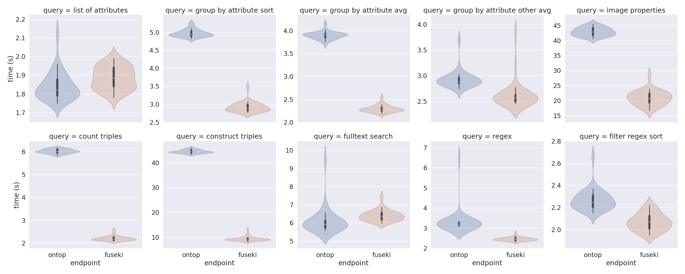
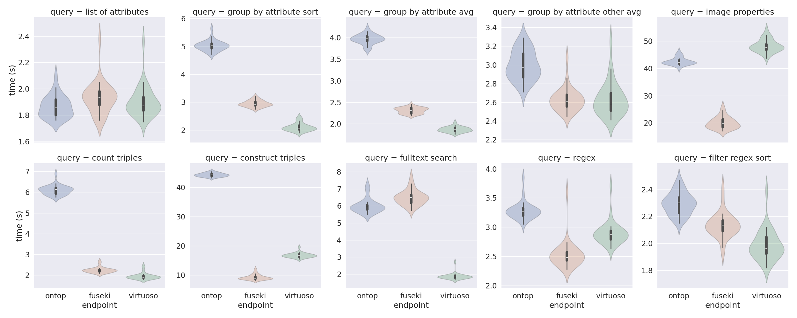

# BioHackathon2024-P4
Repository for project P4 "Endpoint Drafting and Testing" at the 2024 deNBI BioHackathon

## Benchmark environment
### Triplestores and SPARQL endpoints
All endpoints run on the 128.176.233.7 server.

| Name     | Query form                                   | Endpoint (http API)                 | Comments |
|:---------|:---------------------------------------------|:------------------------------------|:---------|
| Ontop    | http://128.176.233.7:8080                     | http://128.176.233.7:8080/sparql     |          |
| Fuseki   | http://128.176.233.7:3030/#/dataset/OME/query | http://128.176.233.7:3030/OME/sparql |          |
| Virtuoso | http://128.176.233.7:8890/sparql              | http://128.176.233.7:8890/sparql     |          |

## SPARQL client
### Apache-Jena 
- Download:  https://dlcdn.apache.org/jena/binaries/apache-jena-5.2.0.tar.gz
- Unpack into a directory and append *\/dir\/to\/apache-jena-5.2.0\/bin\/* to $PATH (on \*N\*X.) 

### Other clients
list download link, installation and usage instruction here.

## Queries
*queries\/* contains a number of SPARQL query files. They can be run on any of the endpoints listed above :
```
rsparql --service http://128.176.233.7:8080/sparql --query 01-list_of_attributes.rq
```

## Timing
The script *queries\/timer.sh* runs a given query N times, measure wall clock, user, and system time
and report the resulting statistics. Timings will be saved to disk.
Usage (must be in the *queries\/* directory):
```
./timer.sh QUERY ENDPOINTURL ENDPOINTNAME NQUERIES
```

##### Example
```
cd queries
./timer.sh 01-list_of_attributes.rq http://128.176.233.7:8080/sparql ontop 100
```
This would run the query *01-list_of_attributes.rq* 
on the ontop endpoint and write results to *01-list_of_attributes.ontop.timings.csv*.


### Timing analysis
The notebook *queries\/analyze_timings.ipynb* loads all timing csv data, performs
some descriptive statistics and renders a number of plots. Adjust to your liking. Required python packages: `pandas, seaborn, matplotlib`.

## Mappings
Mappings are defined in the [omero-ontop-mappings repo](https://github.com/German-BioImaging/omero-ontop-mappings). The repo is cloned on the X.X.X.137 server. Ontop runs inside a `screen` session and normally restarts after a change to
the mappings, ontology, or config. It may become neccessary to restart ontop in case of syntactical errors in any of these files. To (re-)launch the ontop server:
```
screen -dr ontop
cd /home/ubuntu/repos/omero-ontop-mappings/hack24
./run-ontop.sh
```

To leave the screen session press and hold <kbd>CTRL</kbd>, press and release <kbd>a</kbd>, press and release <kbd>d</kbd>, release <kbd>CTRL</kbd>. This brings you back into your login shell. You can then logout from the server, the screen session will continue in the background.

## Further reading
https://medium.com/wallscope/comparing-linked-data-triplestores-ebfac8c3ad4f


# Logbook
## Dec. 10 2024
### Run 1
- executing all queries in *[queries\/](queries/)* from remote via vpn on the X.X.X.137 Muenster server.
- checked all queries can be executed.
- query 09 failed, moved it to *queries\/query_foundry\/*.
- observed that queries run after the test respond faster, suspects there is some caching going on.
- results are saved in *queries\/saved_runs/20241210T091800*
- run metadata in readme.md in than directory.

#### Shell commands
shell command for ontop:
```
cd queries
for q in ??-*.rq; do ./timer.sh $query http://128.176.233.7:8080/sparql ontop 30
```
shell command for fuseki
```
cd queries
for q in ??-*.rq; do ./timer.sh $query http://128.176.233.7:3030/OME/sparql ontop 30
```

#### Results


### Run 2: Run all 10 queries one after the other first on fuseki, then on ontop. Repeat 30 times.

#### Run parameters
- Servers: ontop, fuseki
- number of query repeats: 30
- client ip: 128.176.254.12
- client hostname: micropop046
- client software: apache-jena-5.2.0/bin/rsparql
- rsparql version reported as 4.2.0
- connection: vpn to uni-muenster
- note: changing order of looping over endpoints, rounds, and queries, see script below.
- data generating script: `run_all_queries.sh`

#### Script


```
#! /bin/bash

for query in ??-*.rq; do
    echo "Wall (s),User (s),Sys (s)" > $(basename ${query} .rq).ontop.timings.collected.csv
    echo "Wall (s),User (s),Sys (s)" > $(basename ${query} .rq).fuseki.timings.collected.csv
done

for round in {1..30}; do
    echo "round=$round "
    for query in ??-*.rq; do
        echo "$query "

        echo ontop
        ./timer.sh $query http://128.176.233.7:8080/sparql ontop 1
        cat $(basename ${query} .rq).ontop.timings.csv | tail -1 >> $(basename ${query} .rq).ontop.timings.collected.csv

        echo fuseki
        ./timer.sh $query http://128.176.233.7:3030/OME/sparql fuseki 1
        cat $(basename ${query} .rq).fuseki.timings.csv | tail -1 >> $(basename ${query} .rq).fuseki.timings.collected.csv
    done
done
```


#### Results
Timings come out differently: for many queries, now fuseki is faster, ontop factor 2 slower.


### Run 3: Same logic as Run 2 but including virtuoso
In the meantime, the virtuoso server has come online: http://128.176.233.7:8890/sparql


#### Run parameters
- Servers: ontop, fuseki, virtuoso
- number of query repeats: 30
- client ip: 128.176.254.12
- client hostname: micropop046
- client software: apache-jena-5.2.0/bin/rsparql
- rsparql version reported as 4.2.0
- connection: vpn to uni-muenster
- data generating script: `run_all_queries.sh`

#### Script

```
#! /bin/bash

for query in ??-*.rq; do
    echo "Wall (s),User (s),Sys (s)" > $(basename ${query} .rq).ontop.timings.collected.csv
    echo "Wall (s),User (s),Sys (s)" > $(basename ${query} .rq).fuseki.timings.collected.csv
    echo "Wall (s),User (s),Sys (s)" > $(basename ${query} .rq).virtuoso.timings.collected.csv
done

for round in {1..30}; do
    echo "round=$round "
    for query in ??-*.rq; do
        echo "$query "

        echo ontop
        ./timer.sh $query http://128.176.233.7:8080/sparql ontop 1
        cat $(basename ${query} .rq).ontop.timings.csv | tail -1 >> $(basename ${query} .rq).ontop.timings.collected.csv

        echo fuseki
        ./timer.sh $query http://128.176.233.7:3030/OME/sparql fuseki 1
        cat $(basename ${query} .rq).fuseki.timings.csv | tail -1 >> $(basename ${query} .rq).fuseki.timings.collected.csv

        echo virtuoso
        ./timer.sh $query http://128.176.233.7:8890/sparql virtuoso 1
        cat $(basename ${query} .rq).virtuoso.timings.csv | tail -1 >> $(basename ${query} .rq).virtuoso.timings.collected.csv

    done
done
```


#### Results
A bit difficult to compare to Run 2 above (different colors, different facet order). 
But looking closely, the results from above comparing only ontop and fuseki more or less come out in the same way, again.


## Dec. 11 2024
### Run 4: Query response time vs. number of triples
We first generated rdf.ttl files of reduced size with

```sparql
construct {?s ?p ?o} where {?s ?p ?o} limit <NTRIPLES>
```
`NTRIPLES` is a placeholder which takes on values of 1000, 2000, 5000, 10000, 20000, 50000, 100000, and 200000.

Starting with the 200k triples graph loaded into the fuseki triplestore,
we run 10 queries on the fuseki endpoint, repeat that sequence 10 times. Script is pasted below.

After each run, we drop the default graph
```sparql
drop default
```
and upload the next reduced graph.

#### Script

```
#! /bin/bash

for query in ??-*.rq; do
    echo "Wall (s),User (s),Sys (s)" > $(basename ${query} .rq).fuseki.timings.collected.csv
done

for round in {1..10}; do
    echo "round=$round "
    for query in ??-*.rq; do
        echo "$query "

        echo fuseki
        ./timer.sh $query http://128.176.233.7:3030/OME/sparql fuseki 1
        cat $(basename ${query} .rq).fuseki.timings.csv | tail -1 >> $(basename ${query} .rq).fuseki.timings.collected.csv
    done
done
```

#### Results


The figure shows the measured query response time as function of the number of triples loaded in the Fuseki
triplestore (left: linear x scale, right: log x scale). Each point is the average over 10 identical queries, the various queries are color coded. The shaded
areas mark  1 standard deviation above and below the marker.

#### Discussion
The observed query response time vary with the number of triples and the type of the query. The longest query response time is measured for the "image properties" query, which retrieves all key-value annotations from all images. 
For very small graphs (1000 and 2000 triples), all measured response times coincide at approx. 1s. Up to a certain graph size, each query's response time is at first independent of the graph size before it then starts to increase
at approximately linear scale (query response time ~ number of triples).The 1s pedestal depends on external factors such as network bandwidth, and other processes running on the client system. 


